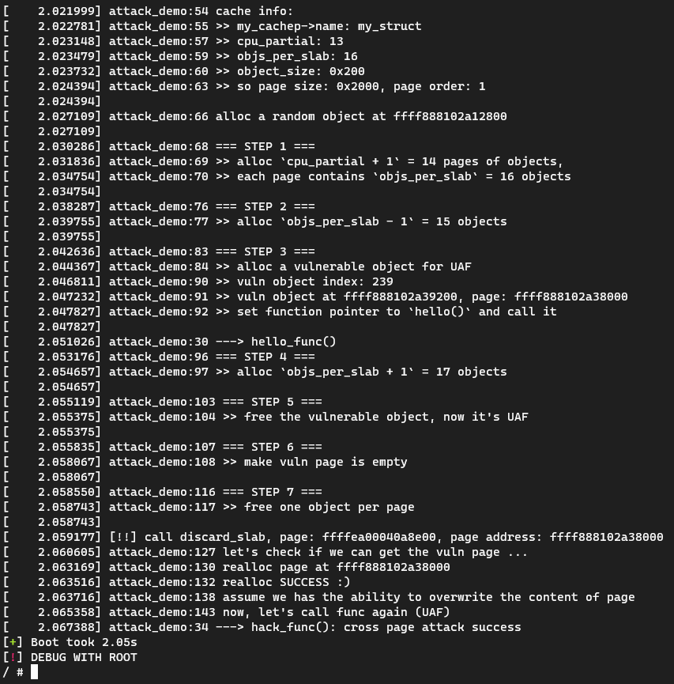

# Cross Page Attack demo

用linux kernel module的形式演示linux kernel中Cross Page Attack的攻击过程。

关于free page的细节，[这篇文章](https://ruia-ruia.github.io/2022/08/05/CVE-2022-29582-io-uring/#how-to-free-a-page)教了很多；
这个demo的代码主要来自[这篇文章](https://www.anquanke.com/post/id/285919#h2-2)，我只是小改了一下。

